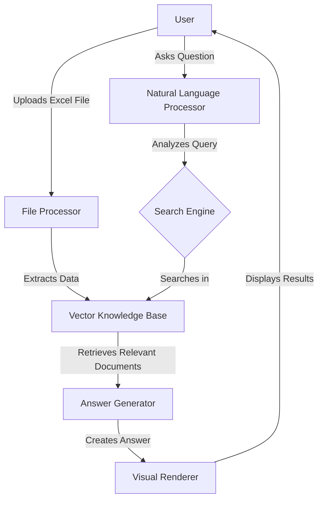

# ServExcel
[](https://github.com/ahmedwagehfawzy08/ServExcel/stargazers)
[](https://github.com/ahmedwagehfawzy08/ServExcel/network/members)
[](https://github.com/ahmedwagehfawzy08/ServExcel/blob/main/LICENSE)

<p align="center">
  
</p>

## 🎥 Project Demo

<p align="center">
  
</p>

## 📝 Project Description

**ServExcel** is an advanced Retrieval Augmented Generation (RAG) system specifically designed to work with Excel files, transforming them into intelligent, queryable knowledge bases. The project allows users to ask natural language questions and receive accurate answers extracted directly from complex Excel spreadsheet data, facilitating information access without requiring advanced programming or analytical skills.

## ✨ App Interface

<p align="center">
  
</p>

## 🚀 Key Features

- ✅ **Intelligent Excel Processing**: Automatically convert any Excel file into a searchable knowledge base
- ✅ **Natural Conversation Interface**: Ask questions in simple language and get accurate answers
- ✅ **Data Visualization**: Display retrieved data in easy-to-understand visual formats
- ✅ **Complex Calculation Support**: Perform advanced calculations on extracted data
- ✅ **Customization and Integration**: Easily integrate the system with other applications and systems
- ✅ **Multilingual Support**: Support for English, Arabic, and other languages
- ✅ **Export and Share**: Export results in multiple formats and share them easily

## 🛠️ Technologies Used

<p align="center">
  
  
  
  
  
  
  
</p>

## 📋 Requirements

- Python 3.8+
- Compatible CUDA (for GPU acceleration - optional but recommended)
- At least 8GB RAM (16GB recommended for large files)
- Node.js and npm for the frontend

## ⚙️ Installation

```bash
# Clone the project
git clone https://github.com/ahmedwagehfawzy08/ServExcel.git

# Navigate to the project directory
cd ServExcel

# Create and activate a virtual environment
python -m venv venv
source venv/bin/activate  # For Linux/Mac
# or
venv\Scripts\activate  # For Windows

# Install requirements
pip install -r requirements.txt

# Run the project
python run.py
```

## 📷 Screenshots

<div align="center">
  <div style="display: flex; justify-content: space-between; margin-bottom: 20px;">
    
    
    
  </div>
  <div style="display: flex; justify-content: space-between; margin-bottom: 20px;">
    
    
    
  </div>
</div>

## 🔄 Project Structure



## 🌟 Use Cases

- **Financial Analysis**: Extract insights and trends from complex financial data
- **Inventory Management**: Track and analyze inventory and sales data
- **Executive Reporting**: Create summaries and reports from large datasets
- **Statistical Analysis**: Perform complex statistical operations with simple commands
- **Decision Support**: Extract information to support strategic decision-making

## 🔒 Security and Privacy

ServExcel ensures complete data privacy with local file processing. Data is not stored on external servers, and all files are encrypted during processing.

## 🙏 Acknowledgements

Thanks to all contributors to this project and the open-source libraries that were used.